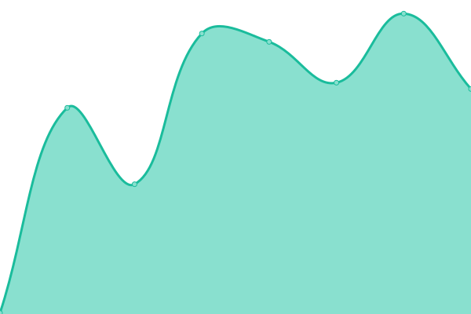
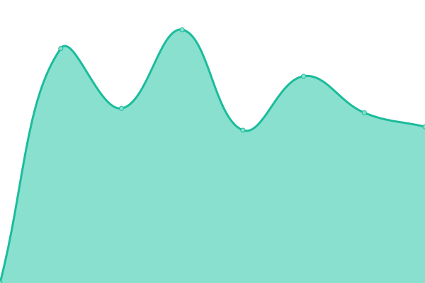
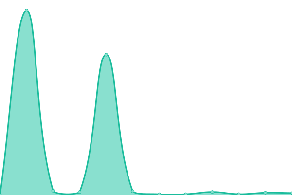

# [📈 Live Status](https://grafixoner.github.io/upptime): <!--live status--> **🟧 Partial outage**

This repository contains the open-source uptime monitor and status page for [Michael Bailey](https://qwip.it), powered by [Upptime](https://github.com/upptime/upptime).

With [Upptime](https://upptime.js.org), you can get your own unlimited and free uptime monitor and status page, powered entirely by a GitHub repository. We use [Issues](https://github.com/grafixoner/upptime/issues) as incident reports, [Actions](https://github.com/grafixoner/upptime/actions) as uptime monitors, and [Pages](https://grafixoner.github.io/upptime) for the status page.

<!--start: status pages-->
<!-- This summary is generated by Upptime (https://github.com/upptime/upptime) -->
<!-- Do not edit this manually, your changes will be overwritten -->
<!-- prettier-ignore -->
| URL | Status | History | Response Time | Uptime |
| --- | ------ | ------- | ------------- | ------ |
|  [Website](https://linkshee.sh) | 🟩 Up | [website.yml](https://github.com/grafixoner/uptime/commits/HEAD/history/website.yml) | 

 185ms
     
 | 

<a href="https://grafixoner.github.io/uptime/history/website">100.00%</a>
    

|  [API Check](https://api.icecreamtruck.io/bombpop/cards/0x5bd238337225509916e85c18b17efdcab0421848) | 🟥 Down | [api-check.yml](https://github.com/grafixoner/uptime/commits/HEAD/history/api-check.yml) | 

 246ms
     
 | 

<a href="https://grafixoner.github.io/uptime/history/api-check">86.09%</a>
    

|  [ETH API Check](https://api.icecreamtruck.io/nfts/ETH/0x12781d45dc31e12a68ed26811503673075d15657/0x6cb26df0c825fece867a84658f87b0ecbcea72f6) | 🟩 Up | [eth-api-check.yml](https://github.com/grafixoner/uptime/commits/HEAD/history/eth-api-check.yml) | 

 310ms
     
 | 

<a href="https://grafixoner.github.io/uptime/history/eth-api-check">100.00%</a>
    

|  [SOL API Check](https://api.icecreamtruck.io/nfts/SOL/GQpoDD6qzKJf9MGjS7QQe3j3x5iepjxDyCcTw42K2W2g/B8yeYdC9SeXxMTrUagTFYDjm6uRyRWQYgoHsXzHGtKMY) | 🟩 Up | [sol-api-check.yml](https://github.com/grafixoner/uptime/commits/HEAD/history/sol-api-check.yml) | 

 1626ms
     
 | 

<a href="https://grafixoner.github.io/uptime/history/sol-api-check">100.00%</a>
    

|  [IPFS Check](https://ipfs.icecreamtruck.io/ipfs/QmNT8hLBZQZRnma1LxwpzQWmbTzEnpnwAqZzEyPxBVQWH7) | 🟩 Up | [ipfs-check.yml](https://github.com/grafixoner/uptime/commits/HEAD/history/ipfs-check.yml) | 

 889ms
     
 | 

<a href="https://grafixoner.github.io/uptime/history/ipfs-check">100.00%</a>
    

<!--end: status pages-->

[**Visit our status website →**](https://grafixoner.github.io/upptime)

## 📄 License

- Powered by: [Upptime](https://github.com/upptime/upptime)
- Code: [MIT](./LICENSE) © [Michael Bailey](https://qwip.it)
- Data in the `./history` directory: [Open Database License](https://opendatacommons.org/licenses/odbl/1-0/)
