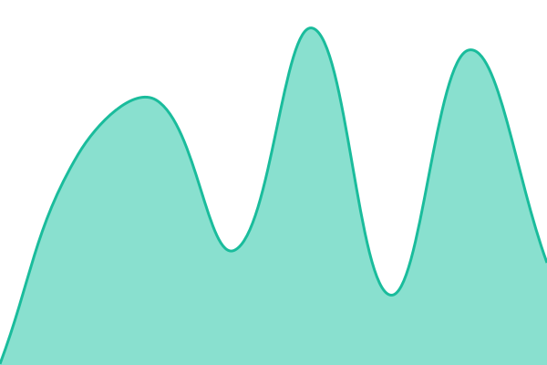
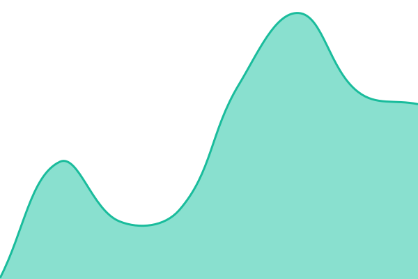
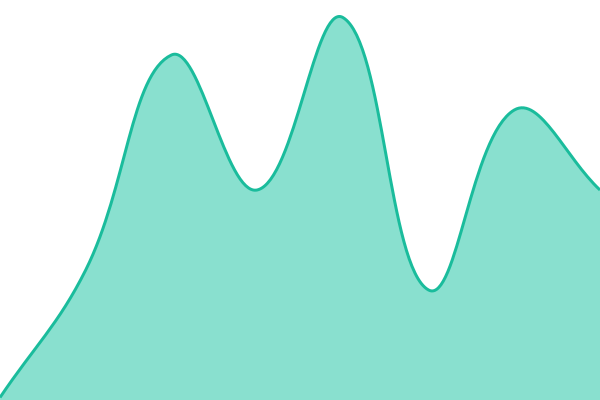
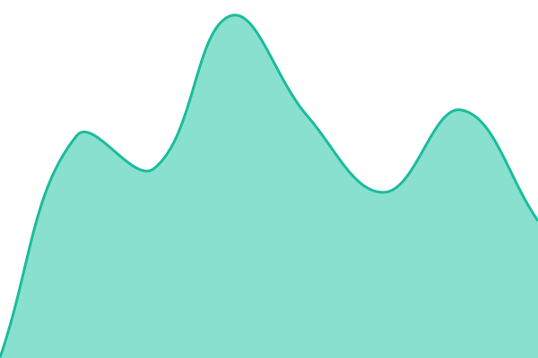
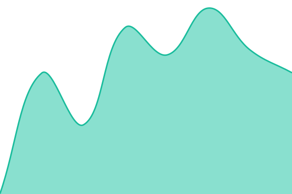

# [📈 Live Status](https://grafixoner.github.io/upptime): <!--live status--> **🟩 All systems operational**

This repository contains the open-source uptime monitor and status page for [Michael Bailey](https://qwip.it), powered by [Upptime](https://github.com/upptime/upptime).

With [Upptime](https://upptime.js.org), you can get your own unlimited and free uptime monitor and status page, powered entirely by a GitHub repository. We use [Issues](https://github.com/grafixoner/upptime/issues) as incident reports, [Actions](https://github.com/grafixoner/upptime/actions) as uptime monitors, and [Pages](https://grafixoner.github.io/upptime) for the status page.

<!--start: status pages-->
<!-- This summary is generated by Upptime (https://github.com/upptime/upptime) -->
<!-- Do not edit this manually, your changes will be overwritten -->
<!-- prettier-ignore -->
| URL | Status | History | Response Time | Uptime |
| --- | ------ | ------- | ------------- | ------ |
|  [Website](https://lollipop.gg) | 🟩 Up | [website.yml](https://github.com/grafixoner/uptime/commits/HEAD/history/website.yml) | 

 178ms
     
 | 

<a href="https://grafixoner.github.io/uptime/history/website">100.00%</a>
    

|  [API Check](https://api.lollipop.gg/check/ibuildcoolshit) | 🟩 Up | [api-check.yml](https://github.com/grafixoner/uptime/commits/HEAD/history/api-check.yml) | 

 167ms
     
 | 

<a href="https://grafixoner.github.io/uptime/history/api-check">100.00%</a>
    

|  [ETH RPC Check](https://api.lollipop.gg/nft/ETH/0x6cb26df0c825fece867a84658f87b0ecbcea72f6/5242) | 🟩 Up | [eth-rpc-check.yml](https://github.com/grafixoner/uptime/commits/HEAD/history/eth-rpc-check.yml) | 

 92ms
     
 | 

<a href="https://grafixoner.github.io/uptime/history/eth-rpc-check">100.00%</a>
    

|  [SOL RPC Check](https://api.lollipop.gg/nft/SOL/6v2wB9GkWy13WKsB5SYCoUfn8FmahqA2yqT7MCMqVdyF) | 🟩 Up | [sol-rpc-check.yml](https://github.com/grafixoner/uptime/commits/HEAD/history/sol-rpc-check.yml) | 

 646ms
     
 | 

<a href="https://grafixoner.github.io/uptime/history/sol-rpc-check">100.00%</a>
    

|  [IPFS Check](https://ipfs.lollipop.gg/ipfs/QmToj2nYmFzNXyzA8RV4Uo7Z2WL17FLSCXtUbaqx9K46vA) | 🟩 Up | [ipfs-check.yml](https://github.com/grafixoner/uptime/commits/HEAD/history/ipfs-check.yml) | 

 382ms
     
 | 

<a href="https://grafixoner.github.io/uptime/history/ipfs-check">100.00%</a>
    

<!--end: status pages-->

[**Visit our status website →**](https://grafixoner.github.io/upptime)

## 📄 License

- Powered by: [Upptime](https://github.com/upptime/upptime)
- Code: [MIT](./LICENSE) © [Michael Bailey](https://qwip.it)
- Data in the `./history` directory: [Open Database License](https://opendatacommons.org/licenses/odbl/1-0/)
